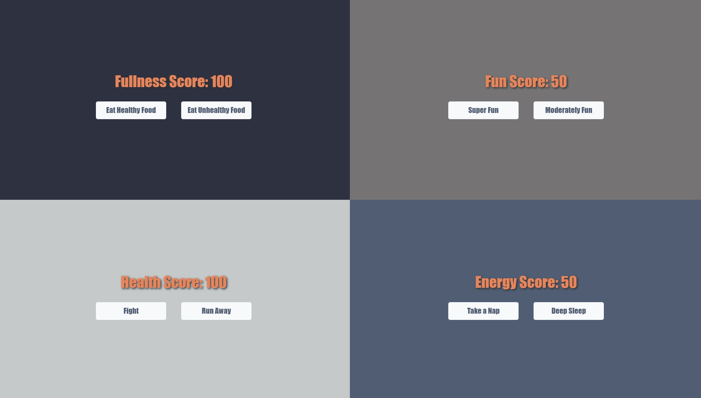

# Title: Tamagotchi 

## Description: In this project, I created a small game where the user can interact with multiple stats, like health or energy levels. The goal was to utilize webpack and become familiar with component javascript. 

## Screenshots

## How To Run
1. Clone down this repo.
1. Make sure you have http-server installed via npm. If you don't have npm, get it here. (https://www.npmjs.com/package/http-server) 
1. On your command line, run `hs -p 8080`
1. In your browser, go to `http://localhost:8080/`
